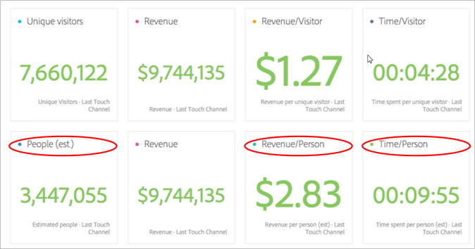
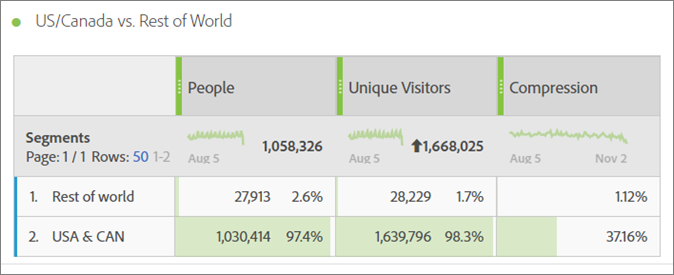
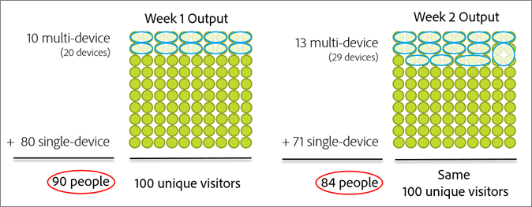
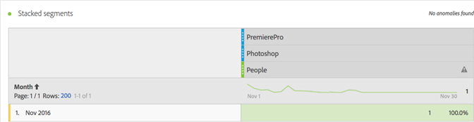
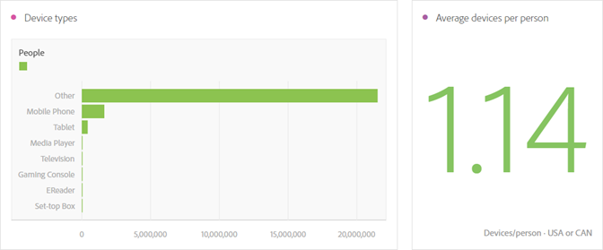
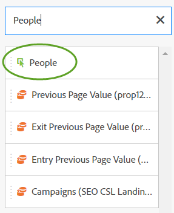

# 人员指标{#people-metric}

“人员”指标是基于Adobe设备图的人员（或设备组）计数。 您可以应用“人员”指标来识别Analysis Workspace各设备上的访客。

## 人员指标先决条件和注意事项 {#section-34551d0435fb4b3cb3fad736b7961541}

<table id="table_120F7EF50042485391E58B22DD00A2A8"> 
 <thead> 
  <tr> 
   <th colname="col1" class="entry"> 先决条件或考虑事项 </th> 
   <th colname="col2" class="entry"> 描述 </th> 
  </tr>
 </thead>
 <tbody> 
  <tr> 
   <td colname="col1"> 
设备协作 
 </td> 
   <td colname="col2"> 
 要使用“人员”指标，请成为Adobe Experience Cloud设 <a href="http://landing.adobe.com/en/na/events/summit/275658-summit-co-op.html" format="html" scope="external"> 备合作社的成员</a>。 该合作社标识个人的多个设备(或Experience CloudID)。 Analytics利用此信息从统计角度推断与品牌互动的人数。 该指标精确到5%以内。 
 
<b>地区</b>:设备合作社目前仅在美国和加拿大提供。 因此，在评估“人员”指标时，您应将区段应用于分析，以仅过滤器您的美国和加拿大数据。 
 
每周，设备图表都会计算合作社的新版本，并发布供使用。 周二，系统会收集最新数据并发布图形的更新版本。 Experience Cloud解决方案随后使用最新版的图形。 对于Analytics，更改将在周三读取，处理更改通常需要1到2个工作日。 
 
 
重要： 当图表每周更新时，它会影响过去的人员指标。 换言之，历史人数统计随着时间的推移而发生变化，因为图表会学习和更新。 例如，如果您今天运行的报表上个月对人员进行计数，然后在图形更新后的一周内运行同一报表，则历史人员计数可能会略有变化。 
 
 </td> 
  </tr> 
  <tr> 
   <td colname="col1"> 度量权限 </td> 
   <td colname="col2"> 
只有在您被授予了对“人员”度量的访问权限时，才可使用“人员”度量。 管理员可以<a href="https://docs.adobe.com/content/help/en/analytics/admin/user-product-management/customize-report-access/groups-metrics.html" format="html" scope="external"> 在“管理工具</a> ”中自定义指标权限。 
 </td> 
  </tr> 
  <tr> 
   <td colname="col1"> 映射到IMS组织 </td> 
   <td colname="col2"> 
将为映射到IMSORG的所有报表包启 <a href="https://docs.adobe.com/content/help/zh-Hans/core-services/interface/about-core-services/report-suite-mapping.html" format="html" scope="external"> 用人员度量</a>。 
 </td> 
  </tr> 
  <tr> 
   <td colname="col1"> 
分析项目／工具 
 </td> 
   <td colname="col2"> 
使用Analysis Workspace、  Ad Hoc Analysis、  Report Builder中的  “人员”指标，并通过API使用。 您可以随时随地使用唯一访客量度，包括计算量度。 
 
例如，创建一个按人计收的指标来替换按唯一访客的收入。 
 
可 <a href="https://docs.adobe.com/content/help/zh-Hans/analytics/analyze/analysis-workspace/build-workspace-project/starter-projects.html" format="html" scope="external"> 以使用Analysis Workspace</a> “人员”量度开始使用“人员”项目模板。 
 </td> 
  </tr> 
  <tr> 
   <td colname="col1"> 
打开机器人规则 
 </td> 
   <td colname="col2"> 
Adobe建议您打开机 <a href="https://docs.adobe.com/content/help/en/analytics/admin/admin-tools/bot-removal/bot-rules.html" format="html" scope="external"> 器规则</a>，尤其是在使用“人员”度量时。 
 
当机器人爬网时，它会人为增加您的“唯一”访客数。 从报表包中删除两个流量可以更准确地衡量数字财产的活动，无论是“唯一访客”还是“人员”。 
 
要执行此操作，请导航到  Analytics &gt;  Admin &gt;  Report Suite。 Select the correct report suite, and then go to  Edit Settings &gt;  General &gt;  Bot Rules. 
 </td> 
  </tr> 
  <tr> 
   <td colname="col1"> 
细分注意事项 
 </td> 
   <td colname="col2"> 
 在将细分与人员指标结合使用时，指标报告可能显着低于预期。 
 
请参 <a href="../other-solutions/people.md#section-d03525420dbe48379fd95b230ef05885" format="dita" scope="local"> 阅将人员指标用于区段</a>。 
 </td> 
  </tr> 
 </tbody> 
</table>

## 人员指标是什么？ {#section-89e2b8f5e80f480391449fc8d1117a6a}

“人员”量度是一种Analytics报告量度，可帮助您将设备归因到人员。 它提供基于人员的营销视图，让您可以衡量访客在所有设备上的活动。 将它想象为一个消除重复的唯一访客版本，您可以将“人员”指标用于以前使用唯一访客的分析。

**设备是人**

在人员指标可用之前，某人（例如）可能会访问您的网站，在三种不同设备上与活动或品牌互动并进行购买，甚至在几分钟内即可完成。 根据您的实施，Analytics可能会将每台设备报告为唯一访客，并将$10归因到$30购买中的三台设备。

人员量度允许您将30美元的购买准确归因为一人：

**提高报表的准确性**

“人员”量度使您能够将多个设备视为一个实体。 以下Analysis Workspace项目显示了独特访客报告与人员报告之间更准确的对比：

并排比较人员和独特访客:

**定义**

<table id="table_F8171AF15DA64607B427E3739EF004D6"> 
 <thead> 
  <tr> 
   <th colname="col1" class="entry"> 项目 </th> 
   <th colname="col2" class="entry"> 描述 </th> 
  </tr>
 </thead>
 <tbody> 
  <tr> 
   <td colname="col1"> 
人员 
 </td> 
   <td colname="col2"> 
“人员”指标基于消费者使用多种设备与您的品牌互动的理念。 您对数据进行的分割或细分越多，同一个人使用该数据分割中的多个设备的可能性就越小。 
 </td> 
  </tr> 
  <tr> 
   <td colname="col1"> 
独特访客 
 </td> 
   <td colname="col2"> 
例如，按日期或时间划分访客的次数越多，“人员”和“唯一”数据之间的差异就越小。 如果您想要更好地了解设备合作社的总体影响，Adobe建议使用最近90天的日期范围 
 </td> 
  </tr> 
  <tr> 
   <td colname="col1"> 
压缩 
 </td> 
   <td colname="col2"> 
使用简单的计算量度，您可以看到“人员”量度占“唯一”访客的百分比的小得多。 单击上表中“压缩”旁的“信息”图标，查看如何创建此度量。 
 
人们可以用在其他计算的指标中，代替“唯一”访客。 
 </td> 
  </tr> 
 </tbody> 
</table>

## 如何计算人员指标？ {#section-0dfb762867e14a7f927796ef3c50592b}

<!--

Analytics uses the HyperLogLog statistical algorithm to calculate People. This means that the smaller the data set, the margin for error may increase. No more than 5% of the numbers should be off by more than 5% 

-->

下图显示了如何计算人员度量，以及如何在过去相同的报告日期范围内随时间减少人员度量。

在此示例中，假定有一组固定的访客。 如果为过去的固定时间范围运行报告，它将显示一组固定访客。 如果设备图表输出第1周左图上显示的数据，则结果为90人。 一周后，在下一次运行设备图表后，将考虑新信息。 如果你运行与一周前相同的报告，人数已经减少到84人。 历史记录已更改，因为设备图提供了有关哪些设备应组合在一起的新信息。

## 将人员指标与细分结合使用 {#section-d03525420dbe48379fd95b230ef05885}

将细分与人员指标结合使用时，指标结果可能显着低于预期。 出现此问题的原因是，在分段中没有 *`person`* 容器。 分段使用访客容器，该容器是定义中的最高级别，基于设备，而不是个人。

此问题主要在使用人员量度堆叠区段时发生。

堆叠区段会创建一个表示区段组合的新区段。 无论您何时：

* 将一个区段置于Analysis Workspace的另一个区段之上。 (这些组件会使用运算符自 *`And`* 动连接。)
* 应用包含运算符的单个 *`And`* 段。
* 在项目级别和表级别应用区段。
* 将虚拟报告套件与另一个区段一起使用。

例如，假定您将以下区段堆放在“人员”量度上：

* `Campaign = Spring Promotion`
* `Site Section = Product Overview`

只计算符合这两个细分的人数 *`using a single device`* 。 （“人员”指标不显示不同设备上符合资格的人员数量。）

此外，在此情 *`Or`* 况下不建议使用运算符。 这样做会产生一个数量，一个数量看到一个或另一个数量的人，而且无法计算两个细分的人数。

有关详 [细信息](https://docs.adobe.com/content/help/zh-Hans/analytics/components/segmentation/segmentation-workflow/seg-build.html) ，请参阅分段帮助中的构建区段。

## 设备类型 {#section-8ab378c84ff34574b9c20fecb3848a86}

当您的报表包包含来自多种设备类型的数据时，设备合作社和人员指标在Adobe Analytics的效果最佳。 例如，将Web和应用程序数据合并到同一报告套件中，可使“人员”指标更强大、更有效。 数据中的设备交叉越多，将多个唯一访客组合为一个人的可能性就越大。

## Experience Cloud ID Service Coverage {#section-bbf0098cac2e467289e7a644a1dea05c}

设备合作社要求您的数字属性必须使用Experience CloudID(MCID)服务进行检测。 如果报表包中的访客包含大量没有MCID的数据，则设备合作社和人员指标的有效性会降低。

<!--
mcdc-people-metric-apply.xml
-->

在Analysis Workspace，创 [建项目](https://docs.adobe.com/content/help/en/analytics/analyze/analysis-workspace/build-workspace-project/t-freeform-project.html)，然后将 **[!UICONTROL People]** 度量拖动到项目表：

