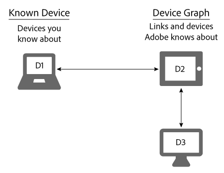

# Known devices{#known-devices}

关于设备图中的已知设备。

在设备图表中，我们提出了 *`known device`*. “已知设备”是指客户用来和品牌进行交互的设备。

>[!NOTE]
>
>在 [!DNL Adobe Experience Cloud Device Co-op]中，条款 *`device`*&#x200B;如 *`person`*、 *`identity`* 等 具有特定含义。例如，“设备”指的是手机或平板电脑等实体硬件或运行于该硬件上的应用程序。请参阅[词汇表](../glossary.md#glossgroup-0f47d7fbd76c4759801f565f341a386c)以查看相关定义。

## Supporting goals with the known device {#section-80deae33660e4280ac65c659ceff5601}

The known device concept supports a few goals essential to the creation and maintenance of an effective [!DNL Device Co-op] program. A known device is one that a [!DNL Device Co-op] member knows about from some interaction with a consumer (e.g., a site visit or by using a mobile app). 基于这些操作，该 [!DNL Device Graph] 成员的已知设备与其 [!DNL Device Co-op] 他成员提供的设备相 [!DNL Device Co-op] 链接。 这些链接可以是确 [定性的或概率的](../processes/links.md#concept-58bb7ab25f904f5f98d645e35205c931)。 这使会员 [!DNL Device Co-op] 受益，因为他们收到：

* 有关已知设备的更多数据。
* 有关其他链接设备的新信息。

The [!DNL Device Graph] will not provide information about device-clusters that a Device Co-op member has not seen.

## Device Co-op goals {#section-75aea5a102d54733aae2a7c6ee9ec6c7}

三个主要目标为动画制作了动 [!DNL Device Co-op]画。 包括：

* **规模：**&#x200B;在各种用例间共享最大数量的可能性链接。
* **公平：** 确保每个成员的 [!DNL Device Co-op] 利益均与其贡献相称。

* **消费者信任**：通过确保消费者的跨设备体验涉及他们已经了解和信任的品牌，来维护和构建消费者信心。

## Scale and the known device {#section-67f734109762457ca62ec306284ea082}

以下方法是设备鉴定为已知设备的更常见方法。 Given these methods, [!DNL Device Co-op] members will almost always have at least 1 known device. This supports the goal of providing maximum scale to all the members of the [!DNL Device Co-op].

**自然**

* 访客访问您的网站或使用您的应用程序。此方法是根据第一方数据确定的。
* 从 CRM 系统登录的客户。

**Marketplace**

* 从 Audience Marketplace 购买区段数据。
* 从第三方数据提供商处购买数据。

**广告**

在拍卖中赢得存货并为设备提供广告。如果该广告包含 [!DNL Audience Manager] 元素，则该设备为已知设备。

## Known devices and fairness use cases {#section-0543188729d845d6b95db70b8b25e9f8}

成员之间 [!DNL Device Co-op] 的联系与他们对公司的贡献相称 [!DNL Device Graph]。 Companies that contribute a lot of devices to the [!DNL Device Graph] receive more links than members who contribute just a few. We believe this helps make the [!DNL Device Co-op] fair for all its members. 让我们看看公平性在下面描述的大品牌用例和小品牌用例中是如何体现的。

**品牌A:大用例**

在此例中，品牌 A 每月拥有 100 位网站访客，并启动了新的跨设备品牌营销活动。For simplicity, assume the [!DNL Device Graph] knows all of the visitors to Brand A are linked to 1 additional device. 这意味着A品牌可以再连接100台设备。 Additionally, the [!DNL Device Graph] contains about 200 devices linked together.

<table id="table_78C38DC522F94BC38C1DB73740C058AC"> 
 <thead> 
  <tr> 
   <th colname="col1" class="entry"> 已知设备数/月 </th> 
   <th colname="col2" class="entry"> 通过设备协作获取的链接设备 </th> 
   <th colname="col3" class="entry"> 可用于营销活动的设备总数 </th> 
  </tr>
 </thead>
 <tbody> 
  <tr> 
   <td colname="col1"> 
100 
 </td> 
   <td colname="col2"> 
100 
 </td> 
   <td colname="col3"> 
200 
 </td> 
  </tr> 
 </tbody> 
</table>

**品牌 B：小品牌用例**

在此示例中，品牌 B 每月拥有 100 位网站访客，并启动了新的跨设备品牌营销活动。For simplicity, assume the [!DNL Device Graph] knows all of the visitors to Brand B are linked to 50 additional devices. 这意味着品牌 B 可以访问 150 个设备。Additionally, the [!DNL Device Graph] contains about 1,000 devices linked together.

<table id="table_A6C9CCF9C6564A89BA7060E075A8E73C"> 
 <thead> 
  <tr> 
   <th colname="col1" class="entry"> 已知设备数/月 </th> 
   <th colname="col2" class="entry"> 通过设备协作获取的链接设备 </th> 
   <th colname="col3" class="entry"> 可用于营销活动的设备总数 </th> 
  </tr>
 </thead>
 <tbody> 
  <tr> 
   <td colname="col1"> 
100 
 </td> 
   <td colname="col2"> 
50 
 </td> 
   <td colname="col3"> 
150 
 </td> 
  </tr> 
 </tbody> 
</table>

>[!MORELIKETHIS]
>
>* [未知设备](../processes/unknown-device.md#concept-95090d341cdc4c22ba4319d79d8f6e40)

