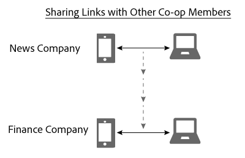

# 设备图中的链接共享{#link-sharing-in-the-device-graph}

关于设备图中的链接共享。

此 [!DNL Device Graph] 与Adobe Experience Cloud Device Co-op的不同成员共享确定性链接和概率性链接。 链接共享会导致 [!DNL Device Co-op] 如此强大。 它扩展了每个成员对与匿名用户关联的设备的了解，但前提是您以前至少见过该匿名用户的其中一种设备。

## 设备图摘要审查 {#section-7858e9f61b5644c981ffb53626fcc19d}

在开始之前，让我们花些时间查看 [!DNL Device Graph] 有效。 董事会成员 [!DNL Device Co-op] 将数据发送到 [!DNL Device Graph]. 此 [!DNL Device Graph] 使用此数据从以下位置构造人员身份 [确定性和概率性链接](../processes/links.md#concept-58bb7ab25f904f5f98d645e35205c931) 设备之间。 As a [!DNL Device Co-op] 参与人，这些链接提供有关经过身份验证的用户、其他用户及其设备之间关系的洞察。 下面部分让我们看一下它的工作方式。

## 链接共享示例 {#section-cb410d827cf14f76bc9b0bd4d31ed767}

以下示例演示了设备协作中的链接共享功能。 在此示例中，我们有2家虚构的公司，即新闻公司和财务公司。 两间公司均为 [!DNL Device Co-op]. 人员A是从多个设备登录或浏览每个公司网站的消费者。

由于人员A已使用他们的手机和平板电脑对新闻网站进行了身份验证，新闻公司会使用消费者ID来识别他们。 它会将该ID发送到 [!DNL Device Graph] 作为加密哈希。 财务公司以前见过这些设备，但人员A尚未登录到网站。 因此，财务公司不知道这些装置是否或如何相互关联，也不知道它们如何与甲人关联。

给定使用者ID的加密哈希， [!DNL Device Graph] 识别这些设备彼此相关，并且与特定人员相关。 不参与 [!DNL Device Co-op] 这些网站访问似乎来自独立的随机设备。 无论如何，只要 [!DNL Device Graph] 具有经过哈希处理的ID：

* 知道手机和笔记本电脑之间存在关联。
* 认识到财务公司想知道手机和笔记本电脑是否关联。

基于这些条件， [!DNL Device Graph] 现在共享连接新闻公司和财务公司这些设备的链接。 在此过程中， [!DNL Device Graph] 复制并共享从一个co-op成员到另一个成员的链接。

此时， [!DNL Device Graph] 已成功执行其角色。 新闻公司和财务公司都有清楚的身份图。 他们可以通过所有设备准确地访问人员A。

## 隐私和链接共享 {#section-7b566018b3304420a4b3e4c079826110}

维护消费者隐私和数据完整性 [!DNL Device Co-op] 成员在整个链接共享过程中至关重要。 在此客户身份识别和链接共享过程中， [!DNL Device Graph] 没有：

* 告诉金融公司该链接来自新闻公司。
* 共享某个人使用的客户ID [!DNL Device Co-op] 成员与另一个成员。
* 提供除移动设备和笔记本电脑共享公共链接之外的任何信息。

## 后续步骤 {#section-ac6e61f1eb6e45b1bb4be8ece39147c7}

阅读有关身份、链接和链接共享的文档，您应该能够很好地了解 [!DNL Device Graph] 在内部组合数据。 作为下一步，我们建议查看我们的文档，其中描述了如何定义 *`known device`* 向设备协作成员提供跨设备链接。 参见 [已知设备](../processes/known-device.md#concept-8e87c276819a48bfac5cef10b45216d1) 和 [未知设备](../processes/unknown-device.md#concept-95090d341cdc4c22ba4319d79d8f6e40).
