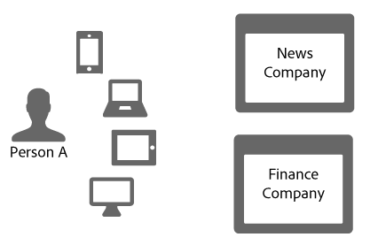

# Link sharing in the Device Graph{#link-sharing-in-the-device-graph}

关于设备图中的链接共享。

The [!DNL Device Graph] shares deterministic and probabilistic links with different members of the Adobe Experience Cloud Device Co-op. Link sharing is what makes the [!DNL Device Co-op] so powerful. 它增强了每个成员对与匿名人员关联的设备的了解，但前提是您以前至少看到过该匿名人员使用的一个设备。

## Device Graph summary review {#section-7858e9f61b5644c981ffb53626fcc19d}

Before getting started, let&#39;s take a moment to review how the [!DNL Device Graph] works. 向发送数 [!DNL Device Co-op] 据的成员 [!DNL Device Graph]。 该数 [!DNL Device Graph] 据用于根据设备之间的确定性和概 [率性链接构造人的身份](../processes/links.md#concept-58bb7ab25f904f5f98d645e35205c931) 。 As a [!DNL Device Co-op] participant, these links provide insight about the relationship between your authenticated users, other users, and their devices. 让我们在下一节中看一下设备协作的工作原理。

## Link sharing example {#section-cb410d827cf14f76bc9b0bd4d31ed767}

以下示例阐述了设备协作中的链接共享功能。在以下示例中，有两家虚构公司：新闻公司和金融公司。Both companies are members of the [!DNL Device Co-op]. 人员 A 是通过多个设备登录或浏览每个公司网站的消费者。

由于人员 A 已通过手机和平板电脑对新闻网站进行身份验证，因此新闻公司将使用消费者 ID 来识别它们。It sends that ID to the [!DNL Device Graph] as a cryptographic hash. 金融公司以前见过这些设备，但是人员 A 从未登录到该网站。因此，金融公司不知道这些设备是否相关或如何相关，也不知道如何将它们与人员 A 相关联。

Given the cryptographic hash of the consumer ID, the [!DNL Device Graph] recognizes that these devices are related to each other and a particular person. To companies that do not participate in the [!DNL Device Co-op] these site visits would appear to come from separate, random devices. In any case, once the [!DNL Device Graph] has the hashed ID it:

* 知道手机和笔记本电脑已链接。
* 认识到金融公司希望知道手机和笔记本电脑是否已链接。

Given these conditions, the [!DNL Device Graph] now shares the link connecting these devices for the News Company with the Finance Company. During this process, the [!DNL Device Graph] duplicates and shares the link from one co-op member to another.

At this point, the [!DNL Device Graph] performed its role successfully. 新闻公司和金融公司都清楚地了解身份。他们可以通过 人员 A 的所有设备准确地联系人员 A。

## Privacy and link sharing {#section-7b566018b3304420a4b3e4c079826110}

Maintaining consumer privacy and data integrity for [!DNL Device Co-op] members is crucial throughout the link sharing process. During this customer identification and link sharing process the [!DNL Device Graph] did not:

* 告知金融公司，该链接来自新闻公司。
* Share the customer ID used by one [!DNL Device Co-op] member with another.
* 提供移动设备和笔记本电脑共享链接以外的任何信息。

## 后续步骤 {#section-ac6e61f1eb6e45b1bb4be8ece39147c7}

Reading the documentation on identity, linking, and link sharing should give you a good sense of how the [!DNL Device Graph] assembles data internally. 下一步，我们建议查看我们的文档，其中描述了设备协作成员的 *`known device`* 跨设备链接如何提供。 请参 [阅已知设备](../processes/known-device.md#concept-8e87c276819a48bfac5cef10b45216d1) 和 [未知设备](../processes/unknown-device.md#concept-95090d341cdc4c22ba4319d79d8f6e40)。
