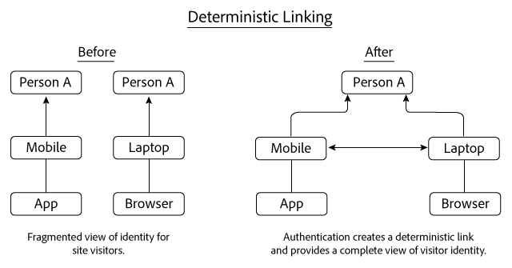
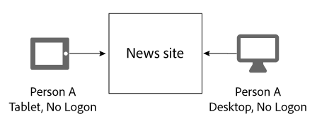
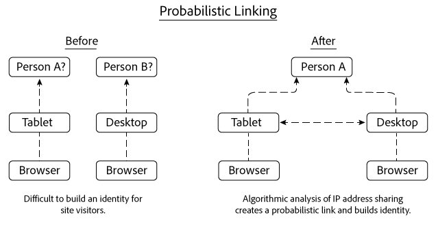
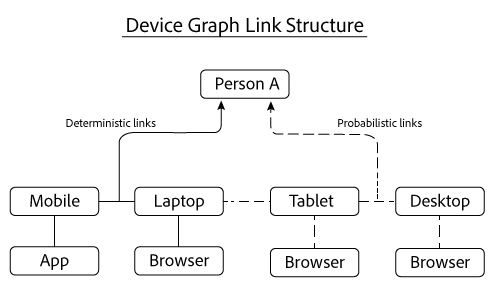

# Deterministic and probabilistic links{#deterministic-and-probabilistic-links}

设备图表如何分析确定性和概率性数据以构建将设备连接在一起的地图。

In the [!DNL Device Graph], internal processes build an identity hierarchy that maps devices and connects them to individual, anonymized people. 图形的输出包括可用于定位的跨设备链接以及在选定的Experience Cloud解决方案中公开的数据。 The Adobe solutions that work with [!DNL Device Graph] data include Analytics, Audience Manager, Media Optimizer, and Target.

The [!DNL Device Graph] analyzes deterministic and probabilistic data to build a map that links devices together. 确定性数据根据经过哈希加密后的登录信息，将各种设备链接起来。可能性数据根据 IP 地址和其他元数据等信息将各种设备链接起来。The [!DNL Device Graph] associates the linked device clusters to an anonymous individual person These connections let digital marketers reach people instead of devices. In the [!DNL Device Graph], the owner of a device is the anonymous representation of a real-life person. 确定性和可能性链接有助于创建用户身份结构。

>[!NOTE]
>
>在Adobe Experience Cloud Device Co-op中，设备、人物和身份等术 *语*，具 *有特*&#x200B;定含义 ** 。 For example, *device* can refer to physical hardware such as a phone or tablet and the applications that run on that hardware. 请参阅[词汇表](../glossary.md#glossgroup-0f47d7fbd76c4759801f565f341a386c)以查看相关定义。

## What are links? {#section-2df4c6f01eba49369993146df0661f13}

当我们谈到链接时，请务必记住链接在 [!DNL Experience Cloud] 设备图表上下文的真正含义。在设备图表上下文中，链接不是指设备之间的实际联系，而是指设备图表将不同设备关联到同一个未知人员的方式。例如，假设我们有一部手机和一个台式计算机浏览器。当设备图表确定这两个设备的使用者为同一个未知人员后，手机和浏览器就被视为“已链接”。正如下文所述，设备图表使用确定性链接和可能性链接构建身份。而且在设备图表中，设备所有者是真实人员的匿名表示。

## Deterministic links {#section-33d41e828a674b398e36fe63da20ac09}

确定性链接根据身份验证事件（例如，从设备到网站的登录操作）将设备与人员链接起来。此操作会创建一个匿名标识符，即消费者 ID。我们来看一下确定性链接的工作原理。在以下示例中，人员 A 通过移动设备上的应用程序登录新闻网站。晚些时候，人员 A 再次登录该网站，但是这次是通过笔记本电脑上的浏览器登录的。

根据登录信息，设备图表可以：

* 知道人员 A 已使用手机/应用程序和笔记本电脑设备/浏览器通过了新闻网站的身份验证。
* 将这些设备与人员 A 链接起来。
* 根据与匿名人员关联的链接设备构建身份。

>[!NOTE]
>
>该数据中 [!DNL Adobe Experience Cloud Device Co-op] 的或 [!DNL Device Graph] 者都不接收实际的身份验证信息或个人识别信息(PII)。 Members of the [!DNL Experience Cloud Device Co-op], pass in cryptographically hashed, unique consumer IDs to the Device Graph. 此消费者 ID 代表图表中经过身份验证的用户，可保护消费者隐私。

## Probabilistic links {#section-5f5aa755da984f9d851f7cb380262998}

可能性链接根据以下特征和元数据，通过算法将设备与人员关联起来：

* 浏览行为
* IP 地址
* 操作系统
* IDFA 和 GAID 标识符

我们来看一下可能性链接的工作原理。在以下示例中，人员 A 先在平板电脑上浏览新闻网站，然后从台式计算机上浏览。在浏览期间，人员 A 没有登录到该新闻网站。每次单独访问时，平板电脑和台式计算机使用同一个 IP 地址。

Based on this information, the [!DNL Device Graph] evaluates IP address sharing patterns between both devices and links these devices together if the results suggest they belong to Person A. The end result is hierarchy of identity derived from algorithmic probability calculations.

在以上示例中，如果两个设备被用来访问同一个新闻网站，则设备图表会将这两个设备链接起来。但是，并不是访问过同一个网站的设备就会被链接起来。为了这说明这一点，我们假设此示例中的每个设备访问的网站完全不同。The [!DNL Device Graph] algorithm can still make a probabilistic link based on their shared IP address and from an analysis of other data. 这样处理有助于为 [!DNL Experience Cloud] 设备协作成员创建强大的可能性链接。

## Both types of data provide value {#section-43d22d8c10634edcb261e7bda6fdf323}

确定性数据和可能性数据是互补的。相比而言，仅包含确定性数据的设备图表让您对人员身份的认识有限。如果未经身份验证，设备图表无法告诉您其他设备和浏览您网站的人员。而可能性数据却可以建立这些联系，并帮助您访问未经身份验证的设备、人员和家庭。

但确定性数据也非常重要。例如，确定性数据可通过删除可能性标志较多且重复的位置（例如，咖啡店、图书馆、机场等）中生成的错误链接，来提高可能性决策制定。

与单独使用任何数据类型相比，设备图表通过同时使用这两种数据类型，可以让您更加全面地了解人员身份。

